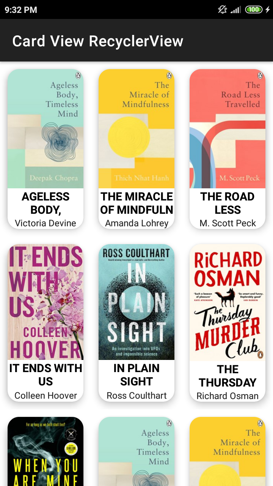
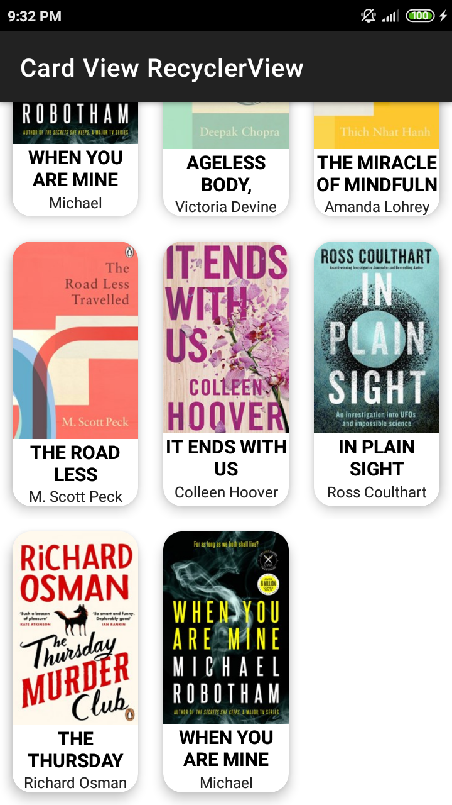

# CardView RecyclerView

Add the following code below to your module build.gradle file:

```groovy:
buildFeatures {
    viewBinding true
}
```
<br></br>
#### MainActivity
 &nbsp;&nbsp;&nbsp; 
<br></br>

#### DetailActivity
